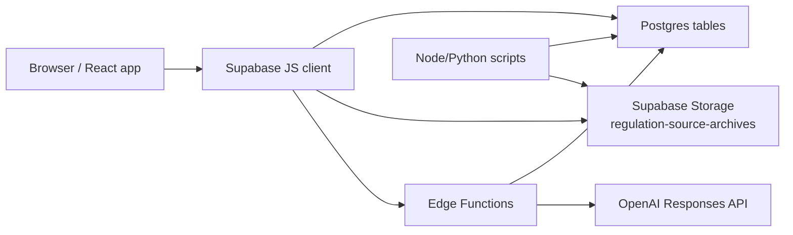

# ESG Advisor Architecture Handbook

This document is the maintainer handoff for the ESG Advisor web application as it exists in this repository on May 14, 2026.

It is written to help a new engineer understand:

- how the frontend is structured
- how Supabase is used as the backend
- how regulation data, source links, and PDFs flow through the system
- how the AI advisor is grounded in indexed source material
- how the admin control room fits into the overall product
- where the important scripts and operational workflows live

This is intentionally practical. It describes the app that exists today, including historical seams and current caveats, not an idealized design.

## 1. Product Summary

ESG Advisor is a React + Vite + Supabase application for exploring sustainability regulations, frameworks, and standards.

The app has four major product concerns:

1. Regulation discovery and navigation
2. Source-link management
3. Archived source-document / PDF management
4. Source-grounded AI assistance

The most important domain object is the `regulation`. Most of the application is built around showing, enriching, comparing, filtering, and linking regulations to their official website, policy page, and archived PDF evidence.

## 2. Technology Stack

### Frontend

- React 18
- TypeScript
- Vite
- React Router v6
- Tailwind CSS
- Lucide icons
- Recharts
- `react-simple-maps`

### Backend / Platform

- Supabase Postgres
- Supabase Auth
- Supabase Storage
- Supabase Edge Functions

### AI

- OpenAI Responses API
- model currently configured in the Edge Function: `gpt-5.4`

### Data / maintenance scripts

- Node.js scripts for indexing, PDF import, merging, and research seeding
- Python scripts for audits and spreadsheet exports

## 3. Repository Map

### App runtime

- [`src/App.tsx`](/Users/lucas/Documents/GitHub/esg-advisor/src/App.tsx)
- [`src/components/Layout.tsx`](/Users/lucas/Documents/GitHub/esg-advisor/src/components/Layout.tsx)
- [`src/pages/`](/Users/lucas/Documents/GitHub/esg-advisor/src/pages)
- [`src/lib/`](/Users/lucas/Documents/GitHub/esg-advisor/src/lib)
- [`src/types/index.ts`](/Users/lucas/Documents/GitHub/esg-advisor/src/types/index.ts)

### Supabase

- [`supabase/config.toml`](/Users/lucas/Documents/GitHub/esg-advisor/supabase/config.toml)
- [`supabase/migrations/`](/Users/lucas/Documents/GitHub/esg-advisor/supabase/migrations)
- [`supabase/functions/ai-advisor/index.ts`](/Users/lucas/Documents/GitHub/esg-advisor/supabase/functions/ai-advisor/index.ts)
- [`supabase/functions/auth-signup/index.ts`](/Users/lucas/Documents/GitHub/esg-advisor/supabase/functions/auth-signup/index.ts)

### Data and maintenance tooling

- [`scripts/`](/Users/lucas/Documents/GitHub/esg-advisor/scripts)

### Output artifacts and audits

- [`outputs/`](/Users/lucas/Documents/GitHub/esg-advisor/outputs)

## 4. High-Level Runtime Architecture



### Key idea

The browser app mostly reads directly from Supabase using the anon key. It does not have a separate custom application server.

There are only two server-side application endpoints in this repo:

- `ai-advisor`
- `auth-signup`

Everything else is:

- browser -> Supabase database
- browser -> Supabase storage
- scripts -> Supabase database/storage

## 5. App Entry and Shell

### `src/main.tsx`

Bootstraps React and the router.

### `src/App.tsx`

This is the top-level runtime controller.

Responsibilities:

- subscribes to Supabase auth state
- fetches the current user's `profiles` row for admin detection
- mounts all routes
- mounts the auth modal globally

Important details:

- `user` and `isAdmin` are held at the app shell level
- the app uses modal-based auth rather than a normal dedicated `/auth` screen
- `/auth` is redirected to `/esg-home?auth=1`

Important caveat:

- the hidden admin route `/admin/regulation-source-control` is currently accessible without admin gating because that was intentionally relaxed during current development
- the code still contains admin-role detection, but that route no longer enforces it

### `src/components/Layout.tsx`

This is the shared product shell for the user-facing app.

Responsibilities:

- left navigation
- page header
- help menu
- onboarding / workspace tour
- scrolling container
- conditional Admin nav item for Analytics

The hidden admin control room is outside this shell on purpose.

## 6. Route Map

### Public / user routes

- `/esg-home` -> [`RegulationsPage.tsx`](/Users/lucas/Documents/GitHub/esg-advisor/src/pages/RegulationsPage.tsx)
- `/esg-home/:id` -> [`RegulationDetailPage.tsx`](/Users/lucas/Documents/GitHub/esg-advisor/src/pages/RegulationDetailPage.tsx)
- `/framework-library` -> [`DirectionTwoConceptPage.tsx`](/Users/lucas/Documents/GitHub/esg-advisor/src/pages/DirectionTwoConceptPage.tsx)
- `/framework-library/:id` -> [`RegulationDetailPage.tsx`](/Users/lucas/Documents/GitHub/esg-advisor/src/pages/RegulationDetailPage.tsx)
- `/sources/:documentId` -> [`SourceDocumentPage.tsx`](/Users/lucas/Documents/GitHub/esg-advisor/src/pages/SourceDocumentPage.tsx)
- `/timeline` -> [`TimelinePage.tsx`](/Users/lucas/Documents/GitHub/esg-advisor/src/pages/TimelinePage.tsx)
- `/compare` -> [`CompareRegionsPage.tsx`](/Users/lucas/Documents/GitHub/esg-advisor/src/pages/CompareRegionsPage.tsx)
- `/regulatory-map` -> [`WorldMapPage.tsx`](/Users/lucas/Documents/GitHub/esg-advisor/src/pages/WorldMapPage.tsx)
- `/advisor` -> [`AIAdvisorPage.tsx`](/Users/lucas/Documents/GitHub/esg-advisor/src/pages/AIAdvisorPage.tsx)
- `/community` -> [`CommunityPage.tsx`](/Users/lucas/Documents/GitHub/esg-advisor/src/pages/CommunityPage.tsx)
- `/alerts` -> [`AlertsPage.tsx`](/Users/lucas/Documents/GitHub/esg-advisor/src/pages/AlertsPage.tsx)
- `/glossary` -> [`GlossaryPage.tsx`](/Users/lucas/Documents/GitHub/esg-advisor/src/pages/GlossaryPage.tsx)
- `/how-it-works` -> [`GuidePage.tsx`](/Users/lucas/Documents/GitHub/esg-advisor/src/pages/GuidePage.tsx)
- `/assessment` -> [`AssessmentPage.tsx`](/Users/lucas/Documents/GitHub/esg-advisor/src/pages/AssessmentPage.tsx)

### Admin / maintenance route

- `/admin/regulation-source-control` -> [`AdminRegulationSourceDeskPage.tsx`](/Users/lucas/Documents/GitHub/esg-advisor/src/pages/AdminRegulationSourceDeskPage.tsx)

### Auth route

- `/auth/callback` -> [`AuthCallbackPage.tsx`](/Users/lucas/Documents/GitHub/esg-advisor/src/pages/AuthCallbackPage.tsx)

### Conditionally visible admin route

- `/analytics` -> [`AnalyticsPage.tsx`](/Users/lucas/Documents/GitHub/esg-advisor/src/pages/AnalyticsPage.tsx)

## 7. Core Domain Model

Type definitions live in [`src/types/index.ts`](/Users/lucas/Documents/GitHub/esg-advisor/src/types/index.ts).

### `Regulation`

Core user-facing object.

Important fields:

- `id`
- `title`
- `formal_title`
- `description`
- `full_description`
- `region`
- `category`
- `status`
- `effective_date`
- `source_name`
- `source_url`
- `official_source_url`
- `policy_page_url`
- `source_link_kind`
- `human_verified`
- `jurisdiction_type`
- `regulation_type`
- `topics`
- `umbrella_id`
- `umbrella_relation`
- `version_label`

### `RegulationSourceDocument`

Represents a versioned source record attached to a regulation.

Important fields:

- `regulation_id`
- `title`
- `source_name`
- `source_url`
- `official_source_url`
- `policy_page_url`
- `document_url`
- `document_type`
- `version_label`
- `archived_storage_path`
- `archived_public_url`
- `content_sha256`
- `fetch_status`

### `RegulationSourceChunk`

Represents extracted text chunks indexed from a source document for AI retrieval.

Important fields:

- `document_id`
- `regulation_id`
- `chunk_index`
- `content`

## 8. Source-Link Model

This app distinguishes three different link concepts for regulations:

### 1. Official Website

Field:

- `regulations.official_source_url`
- optionally mirrored into `regulation_source_documents.official_source_url`

Meaning:

- publisher / issuer homepage or official external site
- can be HTML or PDF

### 2. Link to Policy

Field:

- `regulations.policy_page_url`
- optionally mirrored into `regulation_source_documents.policy_page_url`

Meaning:

- specific page for the regulation, policy, framework, or standard
- intended to be a deeper URL than the site root
- current product direction is to keep this HTML-only where possible

### 3. Open PDF

Resolved from:

- `regulation_source_documents` where:
  - `document_type = 'pdf'`
  - `archived_public_url` is present

Meaning:

- Supabase-hosted archived PDF copy

This split is one of the most important pieces of the current application design.

## 9. Shared Frontend Logic

### `src/lib/regulations.ts`

This is the most important data-access file in the frontend.

Responsibilities:

- fetch regulations from Supabase
- normalize regulation rows
- merge DB regulations with supplemental hardcoded regulations
- deduplicate supplemental entries against DB entries by identity
- fetch source documents and source chunks
- resolve related family members
- canonicalize some supplemental IDs to real DB records

#### Supplemental regulations

`SUPPLEMENTAL_REGULATIONS` is a large in-code list of framework/standard records that supplement the DB.

Important behavior:

- `fetchAllRegulations()` merges DB rows with supplemental rows
- supplemental rows are excluded if the DB already contains an equivalent record by ID or title/formal-title identity
- `fetchRegulationById()` can map a supplemental slug-like ID back to a canonical DB record if one exists

This means the app is not purely database-driven yet. A maintainer needs to remember that both DB rows and in-code supplemental rows can appear in the runtime dataset.

### `src/lib/regulationSourceLinks.ts`

This is the main link-resolution policy used by the frontend.

Responsibilities:

- sanitize candidate URLs
- ignore Carrots & Sticks links
- ignore archived Supabase URLs when choosing official/policy links
- compute the user-facing `Official Website`
- compute the user-facing `Official Source PDF`
- compute the user-facing `Link to Policy`
- compute the Supabase PDF document used for `Open PDF`

If source-button behavior looks wrong in the UI, this is the first file to check.

### `src/lib/openExternal.ts`

Used to open external URLs in a new tab only.

This helper exists because embedded browsers were previously causing a double-navigation problem:

- new tab opened
- current tab also navigated

The helper now avoids same-tab fallback navigation.

### `src/lib/userSettings.ts`

Wraps reads and writes to `user_settings`.

Used for:

- ensuring a user settings row exists
- watchlist
- alerts

### `src/lib/auth.ts`

Wraps sign-in, sign-up, and resend-confirmation behavior on the client.

## 10. How the Main User Flows Work

### A. Library / home flow

1. A page loads regulations via `fetchAllRegulations()`
2. The page filters/sorts locally in memory
3. Clicking a regulation navigates to `/framework-library/:id` or `/esg-home/:id`
4. `RegulationDetailPage` loads:
   - the regulation
   - family relations
   - source documents for the regulation and related family members
5. Buttons are resolved from DB-backed values plus source-document rows

### B. Source document flow

1. On a regulation detail page, the `Versioned Source Files` section lists attached documents
2. Clicking the card navigates to `/sources/:documentId`
3. `SourceDocumentPage` loads:
   - the source document row
   - extracted `regulation_source_chunks`
4. The page shows:
   - a back link to the originating regulation page
   - a direct `Open PDF` or `Open Link` action
   - the extracted chunks used by AI

### C. Family flow

`RegulationDetailPage` supports two family patterns:

- child regulation with an `umbrella_id`
- umbrella/parent regulation with children

Family cards now surface:

- `Official Website`
- `Official Source PDF`
- `Link to Policy`
- `Open PDF`

when those are available for each family member.

### D. Watchlist flow

Watchlist state is stored in `user_settings.watched_regulation_ids`.

Most pages:

- read watchlist using `getUserWatchlist`
- optimistically update UI
- persist via `saveUserWatchlist`

### E. AI Advisor flow

1. The frontend gathers selected regulation sources
2. It calls `supabase.functions.invoke('ai-advisor')`
3. The Edge Function:
   - loads indexed source documents
   - loads text chunks from `regulation_source_chunks`
   - ranks chunks against the user prompt
   - builds a strict source-grounded prompt
   - calls OpenAI Responses API
4. The frontend renders:
   - answer text
   - citations
   - excerpt targets back into `/sources/:documentId?chunk=...`

This is retrieval from cached chunks, not live browsing or live document parsing.

## 11. The Regulation Detail Page

File:

- [`src/pages/RegulationDetailPage.tsx`](/Users/lucas/Documents/GitHub/esg-advisor/src/pages/RegulationDetailPage.tsx)

This is the most important product page.

Responsibilities:

- show regulation metadata
- resolve and show source buttons
- show watchlist actions
- show umbrella/family relationships
- show related source documents
- preserve back-navigation state from library/home/source pages
- show the human verification badge

It is shared by both:

- `/framework-library/:id`
- `/esg-home/:id`

That shared usage is important when making UI changes.

## 12. The Hidden Admin Control Room

File:

- [`src/pages/AdminRegulationSourceDeskPage.tsx`](/Users/lucas/Documents/GitHub/esg-advisor/src/pages/AdminRegulationSourceDeskPage.tsx)

Purpose:

- maintenance workspace for source links and PDFs
- hidden route, not linked in the public nav

Current features:

- all regulations listed in a left sidebar
- search by title / formal title / region / source
- sort `A → Z` or `Z → A`
- filters for:
  - official website available
  - link to policy available
  - open PDF available
  - human verified
- current UI button audit
- regulation-level editing for:
  - `source_name`
  - `source_url`
  - `official_source_url`
  - `policy_page_url`
  - `human_verified`
- source-document editing
- source-document creation
- source-document deletion
- direct PDF upload to Supabase Storage for a source-document row
- direct replacement of an existing archived PDF
- removal of a stored PDF from a row
- live preview panes for:
  - official website
  - policy page
  - Supabase PDF

Important implementation detail:

- the list view does not load all full source documents eagerly anymore
- instead it loads lightweight document summaries for availability filtering
- full document rows load on demand for the selected regulation

Important caveat:

- because admin gating was intentionally removed during development, this page is currently only “hidden by URL,” not actually protected

## 13. Human Verification Flag

Current field:

- `regulations.human_verified`

Migration:

- [`20260513113000_add_human_verified_to_regulations.sql`](/Users/lucas/Documents/GitHub/esg-advisor/supabase/migrations/20260513113000_add_human_verified_to_regulations.sql)

Where it appears:

- control room list and detail
- regulation detail page
- framework library cards
- ESG home cards

Meaning:

- a human reviewer explicitly checked the record

Important note:

- the UI is wired for it
- persistence requires the migration to be applied in the target Supabase project

## 14. Supabase Backend

### Config

File:

- [`supabase/config.toml`](/Users/lucas/Documents/GitHub/esg-advisor/supabase/config.toml)

Current project reference:

- `twjaqynuamghrobhdasf`

Configured Edge Functions:

- `ai-advisor`
- `auth-signup`

### Core tables created in the local migration chain

These are definitely created by the migration files in this repo:

- `public.regulations`
- `public.regulation_source_documents`
- `public.regulation_source_chunks`

### Storage bucket created in the local migration chain

- `regulation-source-archives`

### Tables used by the app but not created by the current local migration chain

These are referenced in code but are not created by the regulation/source migrations currently in this repo:

- `profiles`
- `user_settings`
- `community_posts`
- `compliance_records`

Treat these as existing project dependencies. A fresh environment may need additional baseline schema not represented in the current repo migrations.

## 15. Migration History and Schema Evolution

The migration history in this repo shows the current regulation platform evolved in phases:

### Phase 1: research index

- `20260403_create_regulation_research_index.sql`

Introduced:

- `regulation_source_documents`
- `regulation_source_chunks`
- RLS for public reads on indexed documents/chunks

### Phase 2: archived source storage

- `20260404_add_regulation_source_archives.sql`

Introduced:

- archived storage metadata fields
- storage bucket bootstrap

### Phase 3: base regulations table and family structure

- `20260405_create_regulations_table.sql`
- `20260406_add_regulation_umbrella_fields.sql`

### Phase 4: richer regulation metadata

- `20260409_expand_regulations_catalog_schema.sql`
- `20260425093000_add_regulation_metadata_model.sql`

Introduced / standardized:

- richer status model
- jurisdiction typing
- topics
- source health
- date precision

### Phase 5: Carrots & Sticks bulk import

- `20260423000101` through `20260423000151`

Important:

- the dataset started with a large imported Carrots & Sticks corpus
- later work progressively replaced or supplemented those links with official URLs and archived PDFs

### Phase 6: link normalization

- `20260426093000_add_official_source_urls.sql`
- `20260426101500_backfill_official_source_urls_from_carrots.sql`
- `20260426112000_add_source_link_kind_and_backfill_existing_sources.sql`
- `20260426113000_backfill_carrots_source_link_fallbacks.sql`
- `20260426114000_backfill_curated_source_link_fallbacks.sql`

### Phase 7: policy-page layer

- `20260505113000_add_policy_page_urls.sql`
- later seed batches under `20260505...`, `20260506...`, `20260507...`, `20260511...`

These introduce and backfill:

- `policy_page_url`

### Phase 8: human verification

- `20260513113000_add_human_verified_to_regulations.sql`

## 16. Edge Functions

### `ai-advisor`

File:

- [`supabase/functions/ai-advisor/index.ts`](/Users/lucas/Documents/GitHub/esg-advisor/supabase/functions/ai-advisor/index.ts)

Purpose:

- source-grounded ESG research assistant

Inputs:

- mode
- prompt
- optional conversation history
- selected sources

Behavior:

- loads matching `regulation_source_documents`
- loads indexed `regulation_source_chunks`
- scores chunks against the query
- selects the best excerpts
- builds a strict “answer only from supplied excerpts” prompt
- calls OpenAI Responses API
- returns:
  - answer text
  - citation metadata
  - excerpt targets for deep-linking

Important operational requirements:

- `OPENAI_API_KEY`
- `SUPABASE_URL`
- `SUPABASE_SERVICE_ROLE_KEY`

Important design choice:

- if the source materials are not indexed, the function does not “wing it”
- it explicitly tells the user the research index is missing

### `auth-signup`

File:

- [`supabase/functions/auth-signup/index.ts`](/Users/lucas/Documents/GitHub/esg-advisor/supabase/functions/auth-signup/index.ts)

Purpose:

- create a user using the service role
- immediately seed `user_settings`

Important:

- `verify_jwt = false`
- creates users with `email_confirm: true`
- not all frontend auth flows depend on this function today, but it is part of the backend surface

## 17. Authentication and User State

### Browser auth

The browser uses Supabase Auth directly via:

- [`src/lib/supabase.ts`](/Users/lucas/Documents/GitHub/esg-advisor/src/lib/supabase.ts)

### Sign-in / sign-up UX

- modal-based auth via [`src/components/AuthModal.tsx`](/Users/lucas/Documents/GitHub/esg-advisor/src/components/AuthModal.tsx)
- `AuthPage.tsx` and `AuthGuard.tsx` still exist but are not the primary runtime flow today

### Admin detection

`App.tsx` currently reads:

- `profiles.role`
- `profiles.is_admin`

and considers either sufficient for admin access.

## 18. Source Documents, PDFs, and Indexing

This is the most operationally complex part of the app.

### Data model

The app separates:

- regulation metadata
- source-document metadata
- extracted chunks

### Archived PDFs

Supabase-hosted PDFs live in the public storage bucket:

- `regulation-source-archives`

They are surfaced in the UI through `regulation_source_documents.archived_public_url`.

### How the PDF button works

The `Open PDF` button appears when:

- a related source-document row is `document_type = 'pdf'`
- and `archived_public_url` is present

If a PDF exists in storage but that metadata is missing or stale, the UI will not show the button.

### How indexing works

The scripts import PDFs or HTML sources, then write:

- `regulation_source_documents`
- `regulation_source_chunks`

The AI advisor only works from those stored chunks.

## 19. Scripts and Operational Tooling

Scripts live in [`scripts/`](/Users/lucas/Documents/GitHub/esg-advisor/scripts).

### A. Import / indexing scripts

- `import-local-carrotsandsticks-pdfs.mjs`
- `import-official-source-pdfs.mjs`
- `index-regulation-sources.mjs`
- `import-carrotsandsticks.py`
- `insert-carrotsandsticks.py`

Use these when:

- importing the original dataset
- archiving PDFs into Supabase Storage
- indexing extracted text for AI

### B. Link research / enrichment scripts

- `find-official-source-urls.mjs`
- `find-policy-page-urls.mjs`
- `seed-policy-page-urls-live.mjs`
- `sync-supplemental-regulations.mjs`
- `generate_source_link_fallbacks.py`

Use these when:

- researching official source URLs
- researching policy-page URLs
- seeding DB updates
- syncing hardcoded supplemental records

Important note:

- some fallback-related TS files still exist for audit/research tooling, but current runtime link behavior is intended to be DB-backed, not invented at render time

### C. Audit / export scripts

- `audit-local-pdf-import-status.mjs`
- `audit_pdf_button_coverage.py`
- `build_regulation_metadata_audit_workbook.py`
- `export_no_pdf_regulations_audit.py`
- `export_regulation_button_links_audit.py`
- `export_potential_duplicate_regulations_audit.py`
- `export_duplicate_same_pdf_audit.py`
- `export_merged_duplicate_regulations_audit.py`

Use these when:

- checking coverage
- building Excel audits
- identifying duplicates
- validating UI button behavior against live data

### D. Cleanup / merge scripts

- `merge-exact-pdf-duplicates-live.mjs`

Use this with care. It mutates live data and storage.

## 20. Local Development

### App

```bash
npm run dev
```

### Production build check

```bash
npm run build
```

### Supabase schema push

Typical flow:

```bash
npx supabase db push --linked --include-all
```

In this repo’s history, pushes often required:

- `SUPABASE_DB_PASSWORD`
- occasional migration-history repair

### Useful environment values

Frontend:

- `VITE_SUPABASE_URL`
- `VITE_SUPABASE_ANON_KEY`

Script/server side:

- `SUPABASE_SERVICE_ROLE_KEY`
- `SUPABASE_DB_PASSWORD`
- `OPENAI_API_KEY`

## 21. Key Maintenance Workflows

### If you want to add or fix a regulation

Check:

- `src/lib/regulations.ts`
- `supabase/migrations/`
- `scripts/sync-supplemental-regulations.mjs`

Ask:

- is this a true DB record or only a supplemental record?
- should it be merged into the DB?

### If you want to fix source buttons

Check in order:

1. `regulations.official_source_url`
2. `regulations.policy_page_url`
3. attached `regulation_source_documents`
4. `src/lib/regulationSourceLinks.ts`
5. `src/pages/RegulationDetailPage.tsx`

### If a PDF is missing from the UI

Check:

- does a `regulation_source_documents` row exist?
- is `document_type = 'pdf'`?
- is `archived_public_url` populated?
- did the detail page load the correct canonical regulation ID?

### If AI answers are weak or unavailable

Check:

- is the source document indexed?
- are there `regulation_source_chunks` rows?
- is the `ai-advisor` function deployed?
- are Edge Function secrets configured?

### If the control room is wrong but the public page is right

Check:

- lightweight document-summary loading in the control room
- selected full-document loading
- `getUiButtonAudit()`

### If the public page is wrong but the DB looks correct

Check:

- `getRegulationSourceLinks()`
- `getSupabasePdfDocument()`
- dedupe / canonical regulation resolution in `regulations.ts`

## 22. Known Caveats and Historical Seams

These are important for any maintainer.

### 1. Mixed data architecture

The app still mixes:

- live DB rows
- hardcoded supplemental regulations

This is workable but easy to forget.

### 2. Current runtime is DB-first for links, but research artifacts remain

The repo still contains:

- `officialSourceUrlOverrides.ts`
- `officialIssuerSiteFallbacks.ts`
- `manualSourceLinkFallbacks.ts`
- `carrotsSourceLinkFallbacks.ts`

These still matter for research scripts and audits, but not everything here is necessarily part of the live runtime path anymore.

### 3. Not all app tables are represented in the current migration chain

The regulation/source schema is well represented.

The broader product schema is not fully represented here.

### 4. Hidden admin route is not currently secured

This was intentionally relaxed during current work.

If this moves beyond temporary internal use, it should be re-protected before production exposure.

### 5. Storage permissions may block browser-side admin uploads

The control room now supports PDF upload / replacement / deletion, but actual success depends on current Supabase Storage bucket permissions.

If client-side writes are blocked, the next step should be:

- a server-side upload path
- or reintroducing true admin-only credentials / protected actions

### 6. Large frontend bundle

`npm run build` currently passes with a large chunk warning.

This is not breaking the app, but it is a real maintainability/performance issue.

## 23. Recommended “Read This First” File Order for a New Engineer

If you are onboarding, read in this order:

1. [`src/App.tsx`](/Users/lucas/Documents/GitHub/esg-advisor/src/App.tsx)
2. [`src/components/Layout.tsx`](/Users/lucas/Documents/GitHub/esg-advisor/src/components/Layout.tsx)
3. [`src/types/index.ts`](/Users/lucas/Documents/GitHub/esg-advisor/src/types/index.ts)
4. [`src/lib/regulations.ts`](/Users/lucas/Documents/GitHub/esg-advisor/src/lib/regulations.ts)
5. [`src/lib/regulationSourceLinks.ts`](/Users/lucas/Documents/GitHub/esg-advisor/src/lib/regulationSourceLinks.ts)
6. [`src/pages/DirectionTwoConceptPage.tsx`](/Users/lucas/Documents/GitHub/esg-advisor/src/pages/DirectionTwoConceptPage.tsx)
7. [`src/pages/RegulationDetailPage.tsx`](/Users/lucas/Documents/GitHub/esg-advisor/src/pages/RegulationDetailPage.tsx)
8. [`src/pages/SourceDocumentPage.tsx`](/Users/lucas/Documents/GitHub/esg-advisor/src/pages/SourceDocumentPage.tsx)
9. [`src/pages/AdminRegulationSourceDeskPage.tsx`](/Users/lucas/Documents/GitHub/esg-advisor/src/pages/AdminRegulationSourceDeskPage.tsx)
10. [`supabase/functions/ai-advisor/index.ts`](/Users/lucas/Documents/GitHub/esg-advisor/supabase/functions/ai-advisor/index.ts)
11. [`scripts/import-local-carrotsandsticks-pdfs.mjs`](/Users/lucas/Documents/GitHub/esg-advisor/scripts/import-local-carrotsandsticks-pdfs.mjs)
12. [`scripts/find-policy-page-urls.mjs`](/Users/lucas/Documents/GitHub/esg-advisor/scripts/find-policy-page-urls.mjs)

## 24. Recommended Next Cleanup Steps

If this project is going to be maintained by more people, these are the highest-value cleanups:

1. Re-secure the admin control room.
2. Move the remaining supplemental regulations into DB-backed canonical rows where possible.
3. Consolidate or archive legacy fallback files that are no longer part of runtime behavior.
4. Add missing baseline migrations for non-regulation product tables.
5. Split large frontend chunks.
6. Add automated tests for:
   - source-button visibility
   - family-card source actions
   - canonical regulation resolution
   - control-room filters
   - verified badge rendering

## 25. Final Mental Model

If you only remember one thing, remember this:

The app is fundamentally a regulation catalog with a layered evidence system.

- `regulations` tells the app what the rule is
- `regulation_source_documents` tells the app where the evidence lives
- `regulation_source_chunks` tells the AI what text it may cite
- the UI’s job is mostly to resolve the right combination of official site, policy page, and archived PDF for the current context

That mental model makes most of the codebase much easier to understand.
